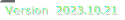
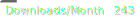
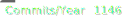

# Tekstialue

Text area (Finnish: tekstialue) - tune planar arrangements of text (tables) to preserve styles across transforms.

## Bug Tracker

Any feature requests or bug reports shall go to the [todos of tekstialue](https://todo.sr.ht/~sthagen/tekstialue).

## Primary Source repository

The main source of `tekstialue` is on a mountain in central Switzerland.
We use distributed version control (git).
There is no central hub.
Every clone can become a new source for the benefit of all.
The preferred public clones of `tekstialue` are:

* [on codeberg](https://codeberg.org/sthagen/tekstialue) - a democratic community-driven, non-profit software development platform operated by Codeberg e.V.
* [at sourcehut](https://git.sr.ht/~sthagen/tekstialue) - a collection of tools useful for software development.

## Contributions

Please do not submit "pull requests" (I found no way to disable that "feature" on GitHub).
If you like to share small changes under the repositories license please kindly do so by sending a patchset.
You can either send such a patchset per email using [git send-email](https://git-send-email.io) or 
if you are a sourcehut user by selecting "Prepare a patchset" on the summary page of your fork at [sourcehut](https://git.sr.ht/).

## Support

Please kindly submit issues at <https://todo.sr.ht/~sthagen/tekstialue> or write plain text email to <~sthagen/tekstialue@lists.sr.ht> to submit patches and request support. Thanks.
