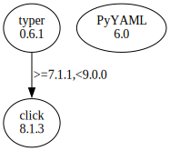

# Third Party Dependencies

<!--[[[fill sbom_sha256()]]]-->
The [SBOM in CycloneDX v1.4 JSON format](https://git.sr.ht/~sthagen/tekstialue/blob/default/etc/sbom/cdx.json) with SHA256 checksum ([6f4fd2eb ...](https://git.sr.ht/~sthagen/tekstialue/blob/default/etc/sbom/cdx.json.sha256 "sha256:6f4fd2eb29d08eec8fd7dd82bdcd4ab8c3f98c0638bb19bf78cf88a0d4ec3ef6")).
<!--[[[end]]] (checksum: faa813b3b7ffc37775ef86a1ab1b35a7)-->
## Licenses 

JSON files with complete license info of: [direct dependencies](direct-dependency-licenses.json) | [all dependencies](all-dependency-licenses.json)

### Direct Dependencies

<!--[[[fill direct_dependencies_table()]]]-->
| Name                                       | Version                                         | License     | Author            | Description (from packaging data)                                  |
|:-------------------------------------------|:------------------------------------------------|:------------|:------------------|:-------------------------------------------------------------------|
| [PyYAML](https://pyyaml.org/)              | [6.0.1](https://pypi.org/project/PyYAML/6.0.1/) | MIT License | Kirill Simonov    | YAML parser and emitter for Python                                 |
| [typer](https://github.com/tiangolo/typer) | [0.9.0](https://pypi.org/project/typer/0.9.0/)  | MIT License | Sebastián Ramírez | Typer, build great CLIs. Easy to code. Based on Python type hints. |
<!--[[[end]]] (checksum: 57e70643e2e7dd9ac365b0676b61d886)-->

### Indirect Dependencies

<!--[[[fill indirect_dependencies_table()]]]-->
| Name                                          | Version                                        | License     | Author                                | Description (from packaging data)         |
|:----------------------------------------------|:-----------------------------------------------|:------------|:--------------------------------------|:------------------------------------------|
| [click](https://palletsprojects.com/p/click/) | [8.1.6](https://pypi.org/project/click/8.1.6/) | BSD License | Pallets <contact@palletsprojects.com> | Composable command line interface toolkit |
<!--[[[end]]] (checksum: 7b69d9be7fa227d2db394dcd865606d8)-->

## Dependency Tree(s)

JSON file with the complete package dependency tree info of: [the full dependency tree](package-dependency-tree.json)

### Rendered SVG

Base graphviz file in dot format: [Trees of the direct dependencies](package-dependency-tree.dot.txt)



### Console Representation

<!--[[[fill dependency_tree_console_text()]]]-->
````console
PyYAML==6.0.1
typer==0.9.0
├── click [required: >=7.1.1,<9.0.0, installed: 8.1.6]
└── typing-extensions [required: >=3.7.4.3, installed: 4.7.1]
````
<!--[[[end]]] (checksum: 5119b6bfd6705217bc581b36cf350f26)-->
